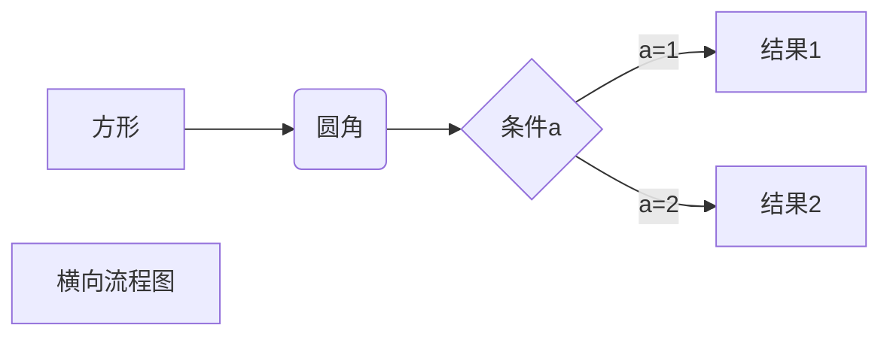
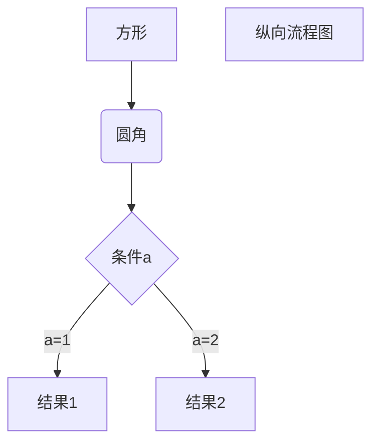
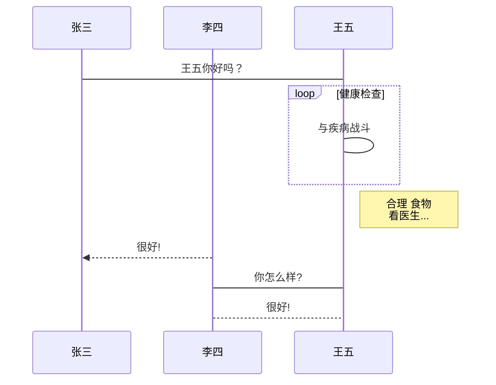
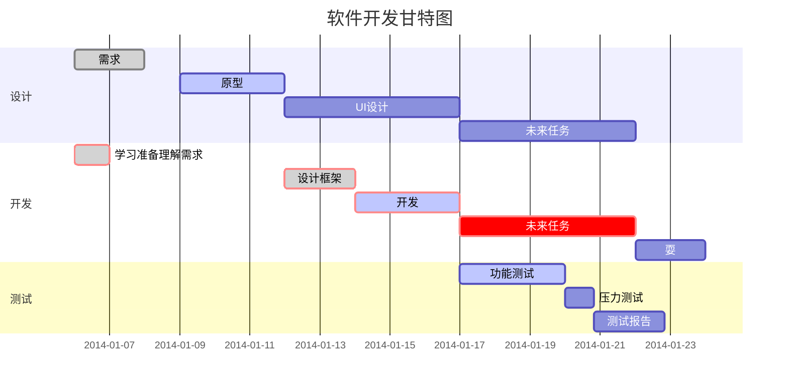

# markdown的流程图、时序图、甘特图画法（typora）

## 帮助

- [Draw Diagrams With Markdown](https://support.typora.io/Draw-Diagrams-With-Markdown/)

其中各图表的支持引擎是：

| 图表种类            | 引擎                                                         |
| ------------------- | ------------------------------------------------------------ |
| 时序图（Sequence）  | [js-sequence](https://bramp.github.io/js-sequence-diagrams/) ，[mermaid](https://knsv.github.io/mermaid/#mermaid) |
| 流程图（Flowchart） | [flowchart.js](http://flowchart.js.org/)                     |
| 甘特图（Gantt）     |                                                              |


### 具体图标示例

### 横向流程图



### 纵向流程图



### 标准流程图

```flow
st=>start: 开始框
op=>operation: 处理框
cond=>condition: 判断框（是/否）
sub1=>subroutine: 子流程
io=>inputoutput: 输入输出框
e=>end: 结束框
st->op->cond
cond(yes)->io->e
cond(no)->sub1(right)->op
```

### 标准流程图源码格式（横向）

```flow
st=>start: 开始框
op=>operation: 处理框
cond=>condition: 判断框(是或否?)
sub1=>subroutine: 子流程
io=>inputoutput: 输入输出框
e=>end: 结束框
st(right)->op(right)->cond
cond(yes)->io(bottom)->e
cond(no)->sub1(right)->op
```

### 时序图

```sequence
Title: 连接建立的过程
客户主机->服务器主机: 连接请求（SYN=1,seq=client_isn） 
服务器主机->客户主机: 授予连接（SYN=1,seq=client_isn）\n ack=client_isn+1
客户主机->服务器主机: 确认（SYN=0,seq=client_isn+1）\nack=server_isn+1
```

#### 时序图源码复杂样例

```sequence
Title: 标题：复杂使用
对象A->对象B: 对象B你好吗?（请求）
Note right of 对象B: 对象B的描述
Note left of 对象A: 对象A的描述(提示)
对象B-->对象A: 我很好(响应)
对象B->小三: 你好吗
小三-->>对象A: 对象B找我了
对象A->对象B: 你真的好吗？
Note over 小三,对象B: 我们是朋友
participant C
Note right of C: 没人陪我玩
```

#### mermaid 时序图样例



### 甘特图



